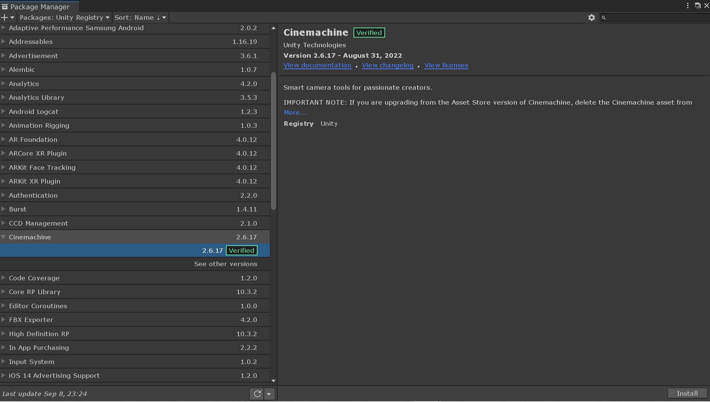
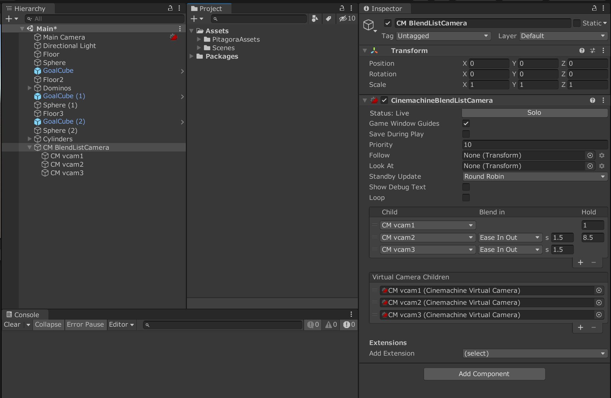

# カメラを滑らかに移動させる方法

## 目次
1. [完成図](#完成図)
1. [実装方法](#実装方法)
1. [参照資料](#参照資料)

## 完成図

## 実装方法
1. 左上のメニューバーのWindowからPackage Managerを開く

1. Package Managerの左上Packages:In ProjectをPackages:Unity Registryに変える

1. Cinemachineをインストールする

1. 左上のメニューバーのCinemachineからCreate Blend List Cameraをクリック

1. CM BlendListCameraオブジェクトが作成されていることを確認

1. Virtual Camera Childrenで仮想カメラの個数を変更する

1. CM BlendListCameraの子オブジェクトである CM vcamで仮想カメラの位置を変更する

1. Childでカメラの移り変わりの順番を指定

1. Blend inでカメラの移動方式と移動に何秒かけるか決める

1. Holdで何秒待機するか決める

## 参照資料
* [【Unity】Cinemachineの全機能を解説！ありとあらゆるカメラワークを高クオリティに作る方法総まとめ](https://light11.hatenadiary.com/entry/2019/10/24/220542)

* [【Unity】CinemachineのVirtual Camera切替をコントロールする](https://tsubakit1.hateblo.jp/entry/2018/04/03/233000)