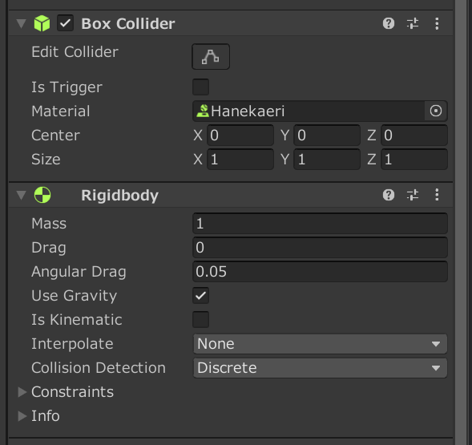
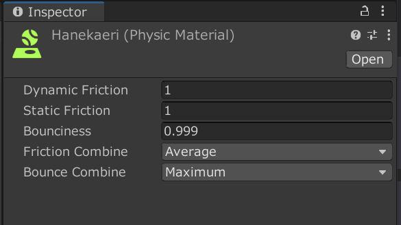

# ブロックをバウンドさせる方法

1. Cubeの作成
Hieraruchyタブで右クリック ➡ 3D object ➡ Cube

1. CubeにBoxColliderとRigidBodyのコンポーネントを追加(写真のようにするがBox ColliderのMaterialの部分は今はなくてよい) 

1. Projectのタブ上で右クリックし、Physic Materialを作成し各項目を設定する(設定する際は下の物理スクリプトの説明を参考にしてください) 

1. Physic MaterialをBox ColliderのMaterialの部分にアタッチする 

## 物理スクリプトの説明
* Dynamic Friction 動摩擦力
* Static Friction 静止摩擦力
* Bounciness 跳ね返り係数
* Friction Combine 摩擦力の範囲
* Bounciness Combine 跳ね返り係数の範囲

[公式ドキュメント](https://docs.unity3d.com/ja/2020.2/Manual/class-PhysicMaterial.html) 